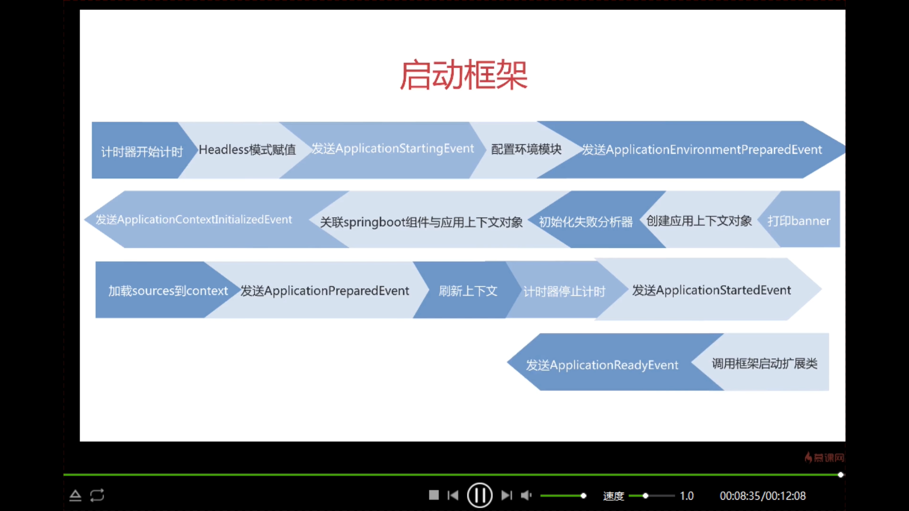

# 框架初始化步骤
## 一 初始化操作
1. 配置资源加载器
2. 配置primarySources
3. 应用环境检测
4. 配置系统初始化器
5. 配置应用监听器
6. 配置main方法所在类

## 二 启动框架
1. 计时器开始计时
2. Headless模式赋值
3. 发送ApplicationStartingEvent
4. 配置环境模块
5. 发送ApplicationEnvironmentPreparedEvent
6. 发送ApplicationContentInitializedEvent
7. 关联springboot组件与应用上下文对象
8. 初始化失败分析器
9. 创建上下文对象
10. 打印banner
11. 记载sources到context
12. 发送ApplicationPreparedEvent
13. 刷新上下文
14. 计时器停止计时
15. 发送ApplicationStartedEvent
16. 发送ApplicationReadyEvent
17. 调用框架启动扩展类

    
# 三 框架自动化装配步骤
1. 收集配置文件中的配置工厂类
2. 加载组件工厂
3. 注册组件内定义bean
